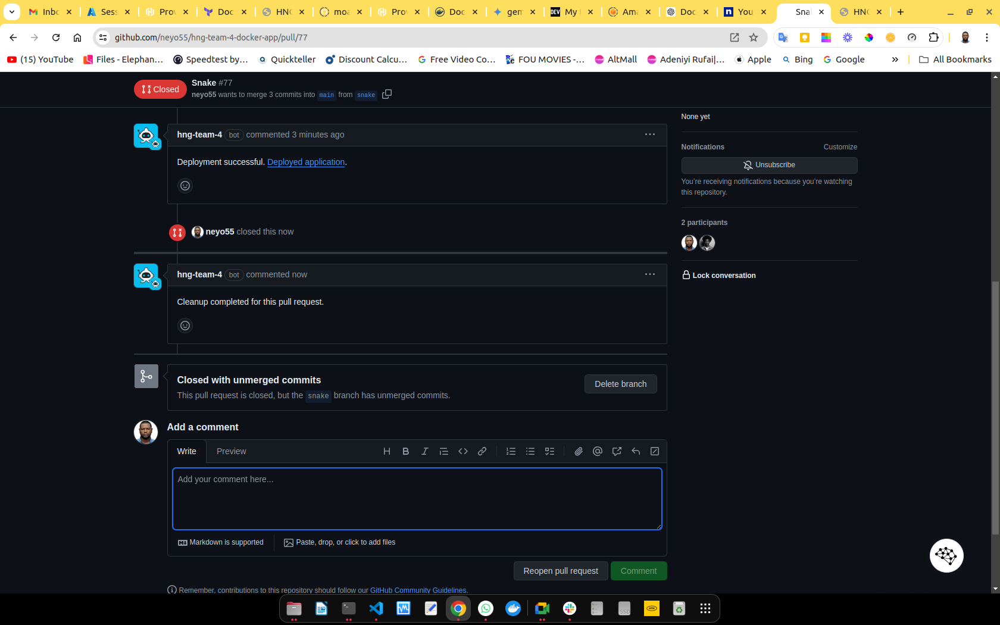
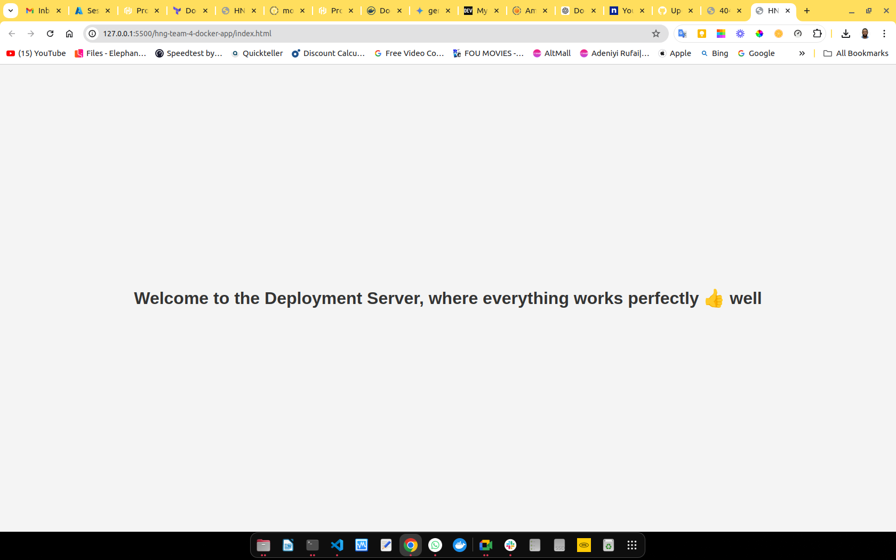

# Docker App for Testing HNG-TEAM-4 Bot

## Overview

This repository contains a simple Docker app designed for testing the HNG-TEAM-4 GitHub bot. The app serves a static HTML page styled with CSS and is used to validate the bot's deployment and cleanup functionalities.

## Repository Contents

- **`index.html`**: The main HTML file that is served by the application.
- **`style.css`**: The stylesheet that provides basic styling for the HTML content.
- **`Dockerfile`**: The Dockerfile used to build the Docker image for the application.

## Testing the Bot

To test the HNG-TEAM-4 bot using this Docker app, follow these steps:

1. **Clone the Repository**:
   - Clone the repository where the bot is installed:

     ```bash
     git clone <repository-url>
     cd <repository-directory>
     ```

2. **Create a New Branch**:
   - Create a new branch to make minor changes:

     ```bash
     git checkout -b test-deployment
     ```

3. **Make Changes**:
   - Make noticeable changes to the `index.html` or `style.css` file. For example, update the text in the HTML file or modify the styling in the CSS file.

4. **Push the Changes**:
   - Push the changes to the remote repository:

     ```bash
     git add .
     git commit -m "Test deployment changes"
     git push origin test-deployment
     ```

5. **Create a Pull Request**:
   - Open a pull request from the `test-deployment` branch to the `main` branch in your GitHub repository. This will trigger the HNG-TEAM-4 bot to initiate a deployment.

6. **Verify Deployment**:
   - The bot will provide a link to the deployed application. Visit this link to check if the deployment was successful and verify that the changes you made are reflected.

## Cleanup Process

After the deployment is successful, the following cleanup process is executed when the pull request is closed, regardless of whether it is merged or not:

1. **Pull Request Closure**:
   - Close the pull request either by merging it or by closing it without merging.

2. **Automatic Cleanup**:
   - The bot will automatically execute the cleanup process to remove the Docker container and any associated resources from the deployment.

3. **Notification**:
   - The bot will prompt the user with a notification confirming that the cleanup was successful.

   

## Example

This image shows the appearance of the `index.html` page on the main branch.



## Conclusion

By following these steps, you can ensure that the HNG-TEAM-4 bot effectively manages both the deployment and cleanup processes. This process helps verify the bot’s ability to handle Dockerized applications and maintain a clean deployment environment.
